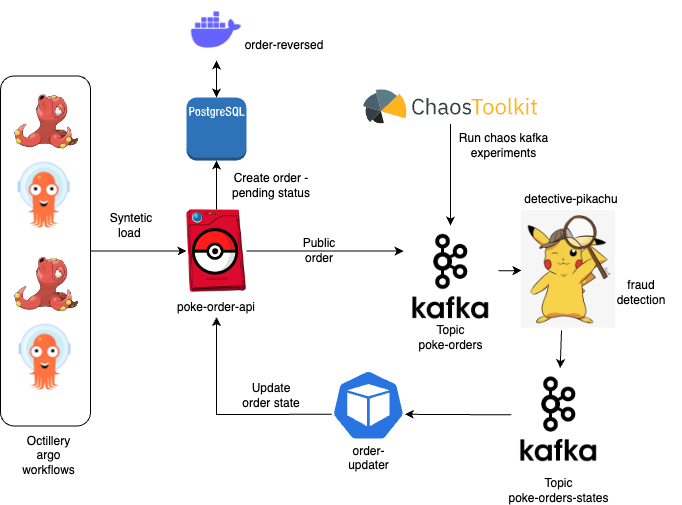
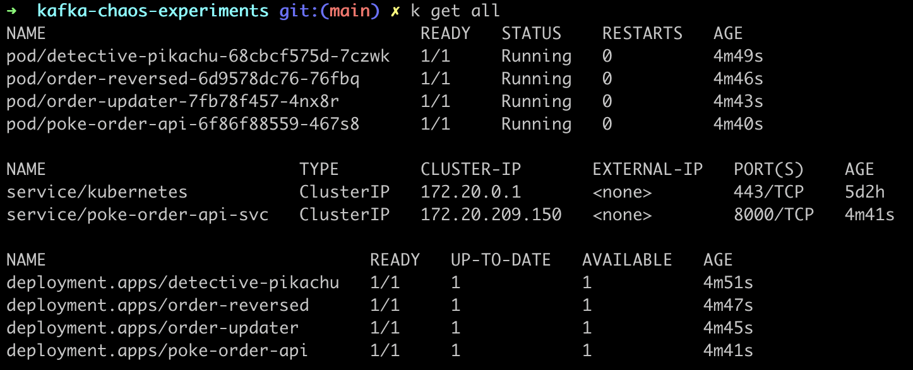
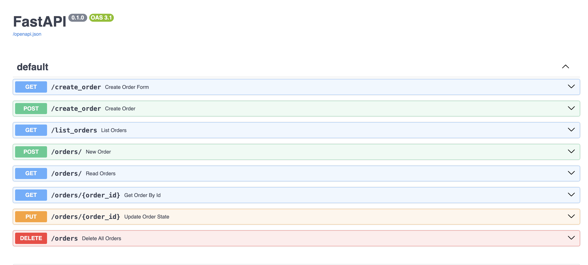

# Kafka Chaos Experiments

This repository contains an application based in a EDA (Event Driven Architecture) Example to run chaos kafka experiments based in chaostoolkit-kafka library. 

## Table of Contents

- [Architecture](#Architecture)
- [Prerequisites](#prerequisites)
- [Installation](#installation)
  - [Docker Compose](#docker-compose)
  - [Kubernetes](#kubernetes)
- [Usage](#usage)
  - [Makefile Targets](#makefile-targets)
- [Contributing](#contributing)
- [License](#license)

# Architecture



This application simulates a Pokémon order site where Pokémon can be purchased and distributed to different countries. The order creation process is synchronous, meaning once an order is created, it is marked as pending in a database and published to a Kafka topic. 

A fraud detection microservice then checks if the order meets certain criteria to be processed. If the order does not meet these criteria, it is marked as rejected. 

If orders are not updated within a certain time (e.g., 2 minutes), a worker checks these pending orders in the database and marks them as reversed to indicate a failure in processing.

## Components

### Octillery
Represents synthetic load generation to simulate orders. This workflow is used to create and send orders through the API, simulating different users placing orders via Argo Workflows.

### Poke-Order-API
Manages Pokémon orders. When an order is received, this API creates an order record in the PostgreSQL database with a pending status and publishes the order to the `poke-orders` Kafka topic.

### PostgreSQL
Stores orders with their initial (pending) status and eventually their updated status after processing.

### Kafka
- **Topic: `poke-orders`**: Receives orders published by the Poke-Order-API.
- **Topic: `poke-orders-states`**: Publishes orders processed by the Detective-Pikachu service.

### Detective-Pikachu
Consumes orders from the `poke-orders` topic and performs fraud detection. If fraud is detected, the order is produced to the `poke-order-states` topic with a rejected status; otherwise, it is marked as successful.

### Order-Updater
Consumes the states of orders from the `poke-orders-states` topic and updates the order status by sending an update request to the Poke-Order-API.

### Order-Reversed
A worker running at regular intervals checks the database for pending orders that have exceeded the set time limit (T minutes). It updates these orders to reversed if they haven't been processed in time.

### Chaos Toolkit
Executes chaos experiments on the system, focusing on the `poke-orders` Kafka topic to test the system's resilience under failure conditions. These experiments help identify and fix vulnerabilities in the architecture. The experiments will be conducted using the `chaostoolkit-kafka` library.


## Prerequisites

Before running the experiments, ensure you have the following installed:

- Docker
- Docker Compose
- Make
- kubectl
- Argo-Workflows CLI
- Infraestructure with Kubernetes Cluster, Kafka(3 brokers), PostgresQL ( you can use https://github.com/jitapichab/iac-playground)

If you want the deployment to be deploy and play, use the following configurations in your database:

- **DB_USER**: `poke_user`
- **DB_PASSWORD**: `poke_password`
- **DB_NAME**: `poke_orders`

## Installation

You can install the application using docker-compose or in kubernetes.

### docker-compose

To testing the application withouth syntetic load

```sh
cd code
docker-compose up
```

Once the application is deployed, you can access to poke-order-api docs via http://localhost:8000/docs#/

### Kubernetes

The Kubernetes installation section is more extensive because this implementation is used to run chaos experiments. In this section, we will install Argo Workflows to generate synthetic load, and both Kafka and the database are externalized.

- First Install Argo workflows

```sh
make install-argo
```

- Run argo workflows to create the kafka topics of the architecture in the first version of the experiment.

```sh
export BOOSTRAP_SERVERS={{your_kafka_bootstrap_servers}} 
argo submit kafka-topics-workflow.yaml -p kafka-bootstrap-servers=$BOOSTRAP_SERVERS -p operation=initial_topics_configuration --watch
```

there are another operations that you can use like **fixed_topic_configurations**, to fix poke-orders topic after a chaos experiment **describe_topics** and **delete_topics**.

- Deploy the kubernetes applications stack

```sh
export BOOSTRAP_SERVERS={{your_kafka_bootstrap_servers}} 
export DB_HOST={{your_db_host}} 
make deploy DB_HOST=$DB_HOST BOOSTRAP_SERVERS=$BOOSTRAP_SERVERS
```



## Testing

once the application is deployed, you can make a port-forwarding in kubernetes to access to the application


```sh
make poke-order-api
```

you can access to poke-order-api docs via http://localhost:8000/docs#/




